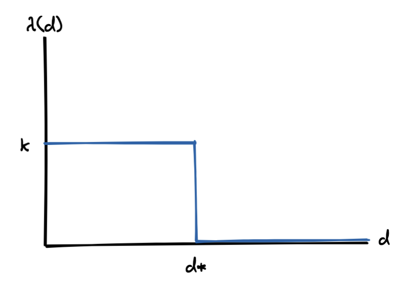
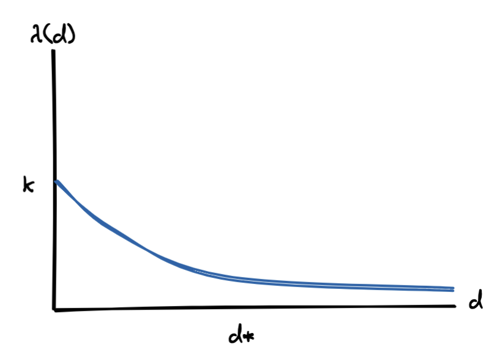
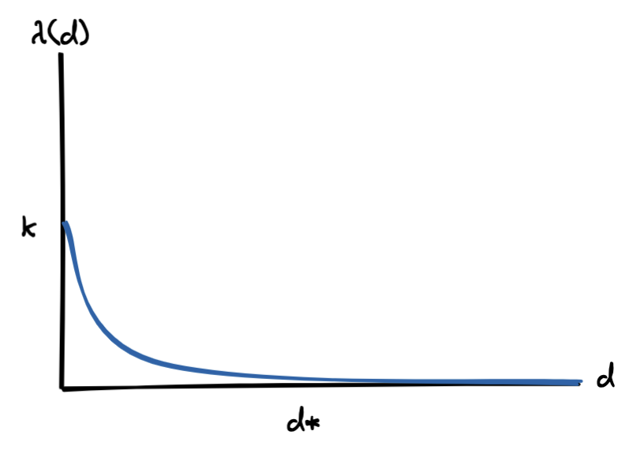
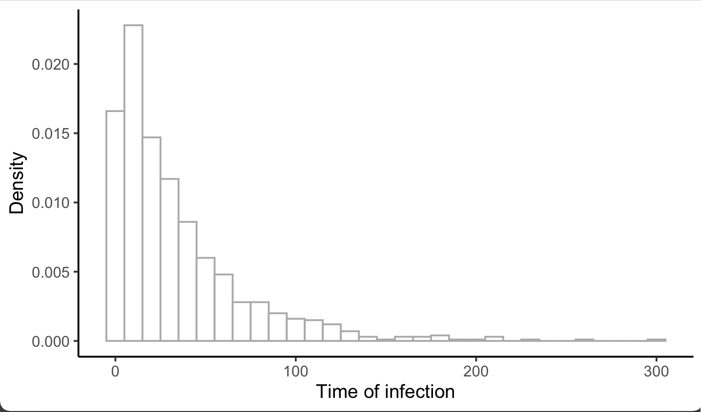
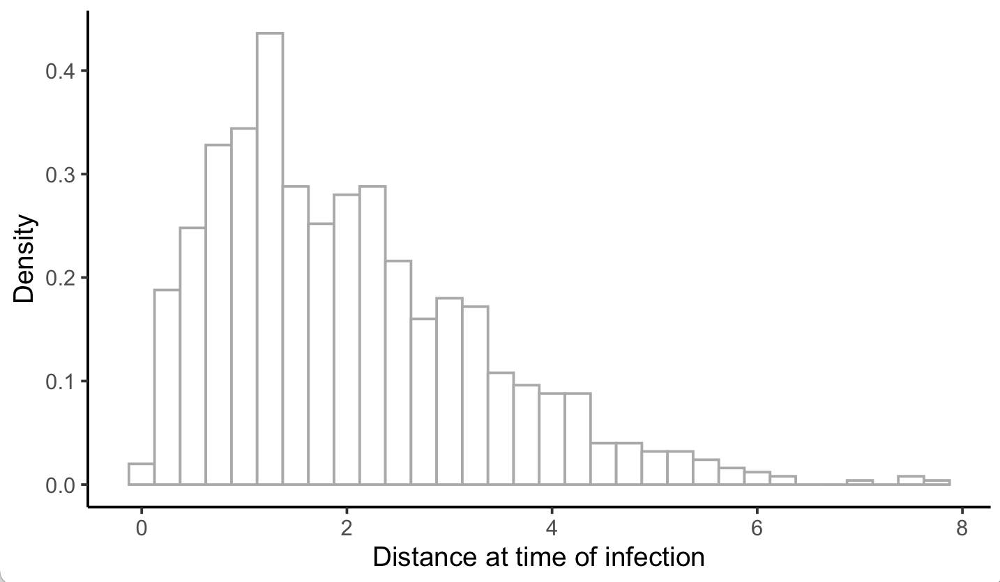

# Project notes

## 18 July 2022 

The goal of this code is to __infer how the probability of transmission depends on the proximity and duration of contact.__ 

We're starting with a straightforward toy model that specifies the instantaneous hazard (force) of infection, $\lambda.$ This hazard can take a few forms: 

- A step function: 

$$
	\lambda(d) = 
	\begin{cases} 
		k & d \leq d^* \\ 
		0 & d > d^*
	\end{cases} 
$$ 

- A power-law decay with distance: 

$$ 
	\lambda(d) = \frac{k}{1 + d^\alpha}
$$ 

- An exponential decay with distance: 

$$ 
	\lambda(d) = k e^{-\phi d}
$$ 

The questions become: 

- Given some observations (locations over time, timing of infection), how precisely can we determine the kernel parameters ( $k$, $d^*$, $\alpha$, $\phi$)? 
- Under which circumstances can we distinguish between these models? 
- When does it matter to be able to distinguish between models? 
- What sorts of experiments do we need to run (sample size, frequency of observation, precision with which we need to know epidemiologic links) to measure the infection kernel with sufficient accuracy to inform interventions (_e.g.,_ isolation period, gathering size restrictions, general risk communication)? 

I'll begin with a simulation model with discrete events in continuous time. That is, I'll define rates for (a) movement and (b) infection and will update these states according to the Gillespie algorithm. Here's the algorithm: 

1. pick a movement distribution (normal with mean 0 and some standard deviation $\sigma$) 
2. pick a movement rate - a kinetic energy of the population. Call it $\mu$.
3. define the hazard of infection as a function with distance. We’ll use $\lambda = k e^{-\phi d}$, where we’ll need to specify *k* (the hazard of infection at proximity of 0) and φ (the exponential rate at which the infection hazard decays)
4. Start the simulation with just two agents moving around. Monitor when the uninfected one gets infected. 

Based on this information, can we determine the shape of the kernel? with what precision? And next, we can ask about uncertainty in both the locations and the time of infection. How does this affect our ability to do inference?

---

Let's start with some simple visualizations of the time to infection occuring, in branch `Explore`.

First, here's a histogram of the times when infections occur: 

Seems... reasonable. Now let's look at the distance between individuals when the infection occurs: 

Seems like this will be much more informative (for the step function, for example, we wouldn't see any infections occurring past $d^* $). 

## 2 Aug 2022

