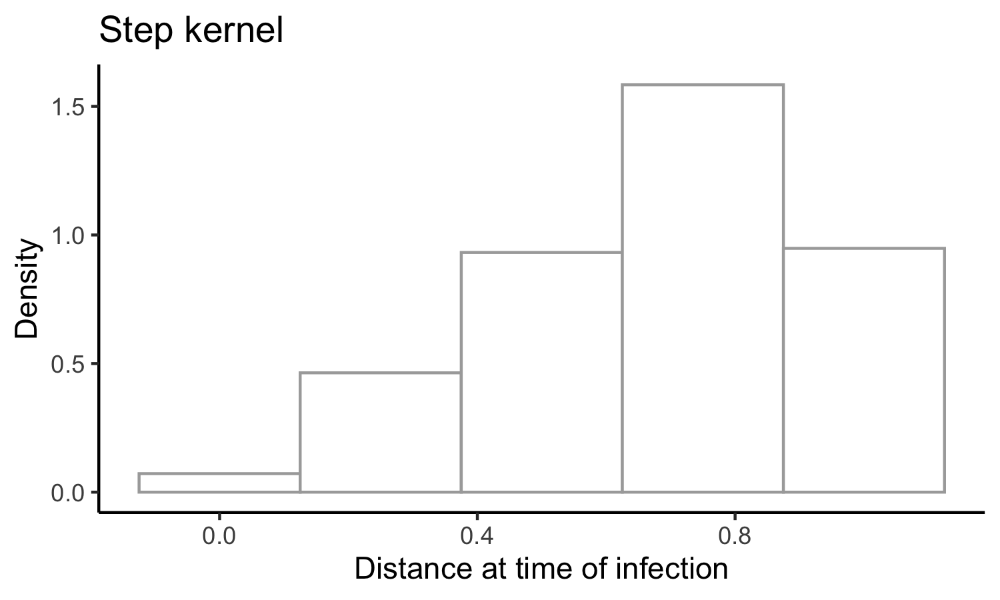
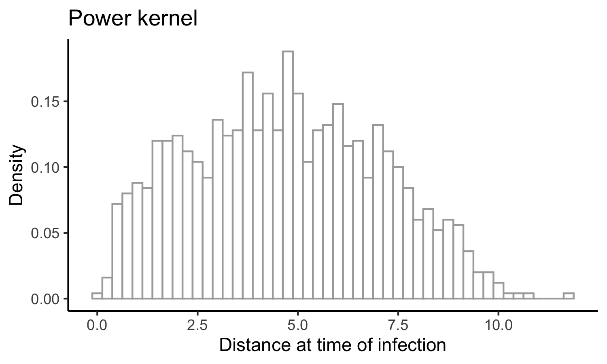
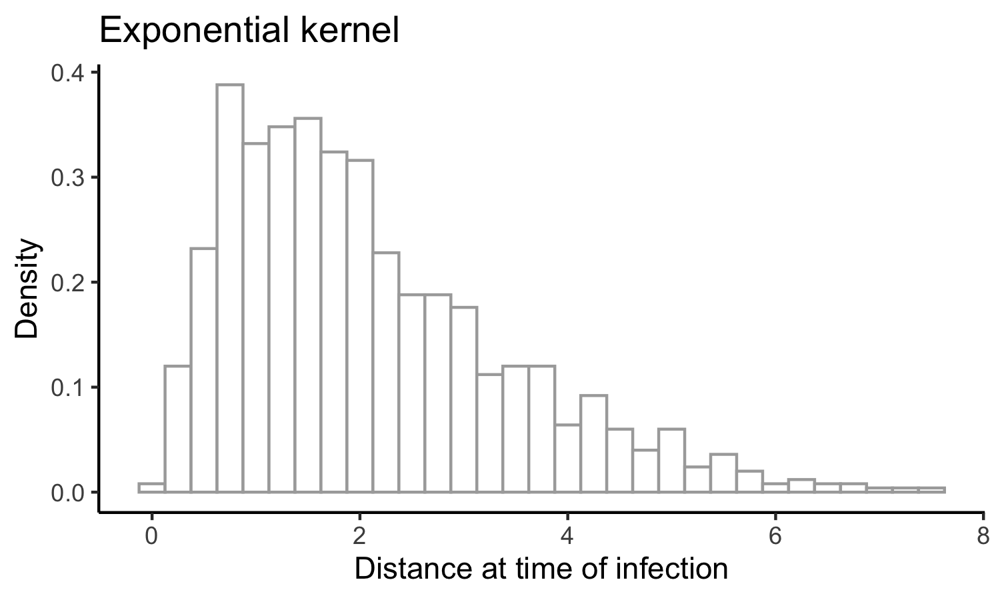
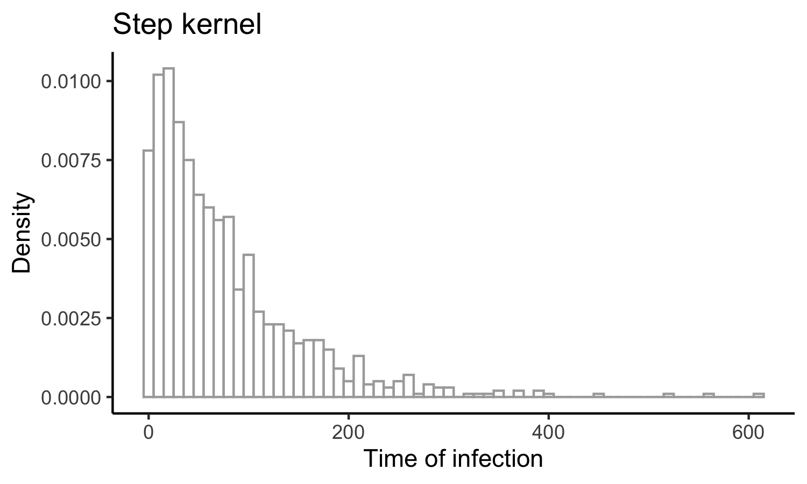
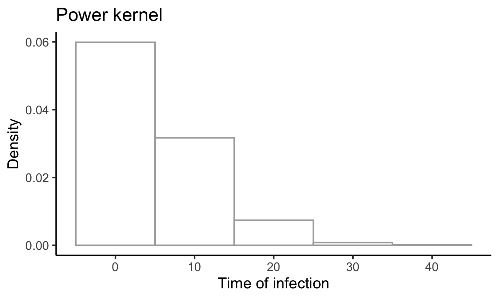
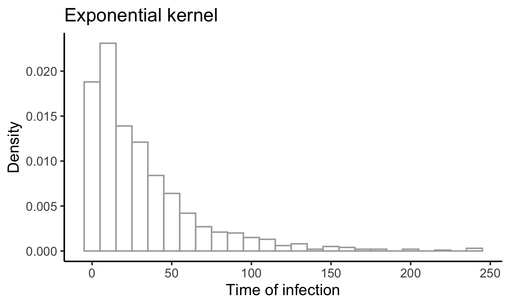
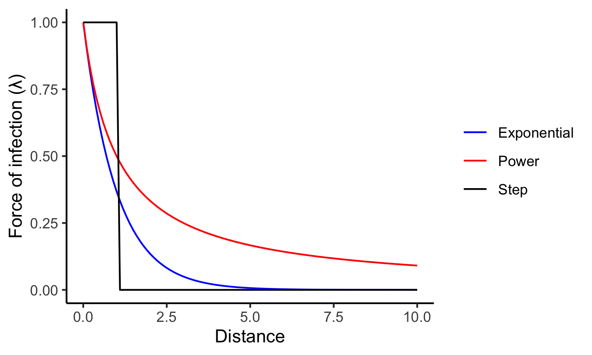

__Jump to__ 

- [18 July 2022](#18-July-2022)
- [2 Aug 2022](#2-Aug-2022)
- [26 Aug 2022](#26-Aug-2022)
- [9 Sep 2022](#9-Sep-2022)
- [13 Sep 2022](#13-Sep-2022)

# 18 July 2022 

The goal of this code is to __infer how the probability of transmission depends on the proximity and duration of contact.__ 

We're starting with a straightforward toy model that specifies the instantaneous hazard (force) of infection, $\lambda.$ This hazard can take a few forms: 

- A step function: 

$$
	\lambda(d) = 
	\begin{cases} 
		k & d \leq d^* \\ 
		0 & d > d^*
	\end{cases} 
$$ 

- A power-law decay with distance: 

$$ 
	\lambda(d) = \frac{k}{1 + d^\alpha}
$$ 

- An exponential decay with distance: 

$$ 
	\lambda(d) = k e^{-\phi d}
$$ 

The questions become: 

- Given some observations (locations over time, timing of infection), how precisely can we determine the kernel parameters ( $k$, $d^*$, $\alpha$, $\phi$)? 
- Under which circumstances can we distinguish between these models? 
- When does it matter to be able to distinguish between models? 
- What sorts of experiments do we need to run (sample size, frequency of observation, precision with which we need to know epidemiologic links) to measure the infection kernel with sufficient accuracy to inform interventions (_e.g.,_ isolation period, gathering size restrictions, general risk communication)? 

I'll begin with a simulation model with discrete events in continuous time. That is, I'll define rates for (a) movement and (b) infection and will update these states according to the Gillespie algorithm. Here's the algorithm: 

1. pick a movement distribution (normal with mean 0 and some standard deviation $\sigma$) 
2. pick a movement rate - a kinetic energy of the population. Call it $\mu$.
3. define the hazard of infection as a function with distance. We’ll use $\lambda = k e^{-\phi d}$, where we’ll need to specify *k* (the hazard of infection at proximity of 0) and φ (the exponential rate at which the infection hazard decays)
4. Start the simulation with just two agents moving around. Monitor when the uninfected one gets infected. 

Based on this information, can we determine the shape of the kernel? with what precision? And next, we can ask about uncertainty in both the locations and the time of infection. How does this affect our ability to do inference?

---

Let's start with some simple visualizations of the time to infection occuring, in branch `Explore`.

First, here's a histogram of the times when infections occur: 

Seems... reasonable. Now let's look at the distance between individuals when the infection occurs: 

Seems like this will be much more informative (for the step function, for example, we wouldn't see any infections occurring past $d^* $). 

# 2 Aug 2022

I've now implemented the power and step kernels. Let's have a look at what the time and distance of infection looks like for these, side-by-side with the exponential kernel: 

and the times of infection: 

Let's have a look at exactly what the kernels look like (how should we ensure comparability between them, somehow? something like a common area under the curve?): 

Given this, it makes sense why the power function would yield such shorter times-to-infection, since there's still substantial force of infection even at the longest distances. The exponential kernel looks a lot more like the step kernel. 

One option might be to come up with a general sigmoidal kernel that has an (optional) neck, something that accommodates power, exponential, and step-like forces of infection. Monotonically decreasing, with at most one change in concavity. That should specify a pretty general class of things. And then the question is: how do these kernels differ in the spread of infection? To what extent can we distinguish between them, and when does it matter to distinguish between them? 

What might such a kernel look like? 

Going back to the distance kernels from my thesis: recall that 

$$ e^{-x} = \lim_{n \rightarrow \infty} (1 + \frac{x}{n})^{-n}$$ 

and so 

$$ k e^{-\phi d} = \lim_{\alpha \rightarrow \infty} k \Bigl( 1 + \frac{\phi d}{\alpha}\Bigr)^{-\alpha} $$

that's more in line with the parameterization I'd proposed earlier. What about the step function? Any way to get this thing consistent with something logistic? Because for now the kernel we're working with is 

$$ \lambda(d)  = k \Bigl( 1 + \frac{\phi d}{\alpha}\Bigl)^{-\alpha} $$

which is a power function that approximates an exponential function with decay rate $\phi$ as $\alpha$ increases. 

Recall that the standard logistic function is 

$$ \frac{1}{1 + e^{-x}} $$ 

Alright - I've ended up with something like 

$$ \lambda(d) = \frac{k \Bigl[1 + (1 - \frac{\phi d^* }{\alpha})^\alpha\Bigr]}{1 + \Bigl(1 + \frac{\phi (d - d^* )}{\alpha}\Bigr)^\alpha} $$

That's almost it - it behaves like I want it to for large $\alpha$, but strangely for small parameter values (near 1). Getting somewhere though. 

# 26 Aug 2022 

I'm going to try to summarize my last meeting with Mark - we'd decided on drafting something of a grant proposal, and it was clear in my head then. It's not clear anymore. Going to try to make it clear again. 

--- 

His idea, I think, was that we have some kind of function we're interested in: like 

$$ \text{contagiousness} = f(\text{infectiousness}, \text{susceptibility}, \text{contact distance}, \text{contact duration}) $$ 

He was claiming that infectiousness and susceptibility are independent: 

$$ p_c = p_i p_s p_{cd} p_{ct} $$ 

and also that 

$$ \text{infection event} = f(\text{contagiousness},\text{contact frequency}) $$ 

where 

$$ p_e = p_c p_f $$ 

I'm not sure these are all the right terms, but that's what we're starting with. 

I think that my angle was that we could incorporate something like this into the renewal equation framework, and ask questions about inference. What set of probability functions are relevant here? Essentially, how can we build up an SIR-like model from a statistical-mechanic framework? 

And a key question: what is it that we're trying to describe with the equations? The probability of getting infected? The total number of infected people? Probably the latter - this is the closest analog to the Boltzman equations - but we'll probably want to aim for both. 

# 9 Sep 2022 

Thinking of things to put into a grant proposal: 

the infectiousness distribution (the thing you integrate to get R0) is a function of things both inherent to the virus and to behavior - critically, to the way people move and interact. How can we build this up from first principles? What data would we need to collect to specify this? What underlying mechanics are consistent with a given epidemiological model?

# 13 Sep 2022

I've gone back to Breda _et al._'s paper, ["On the formulation of epidemic models (an appraisal of Kermack and McKendrick)"](https://www.tandfonline.com/doi/full/10.1080/17513758.2012.716454) to get to grips with renewal equations. I think I've gotten the intuition and its link with the mathematics. I'm going to write it out here so I can refer back when I need to:

