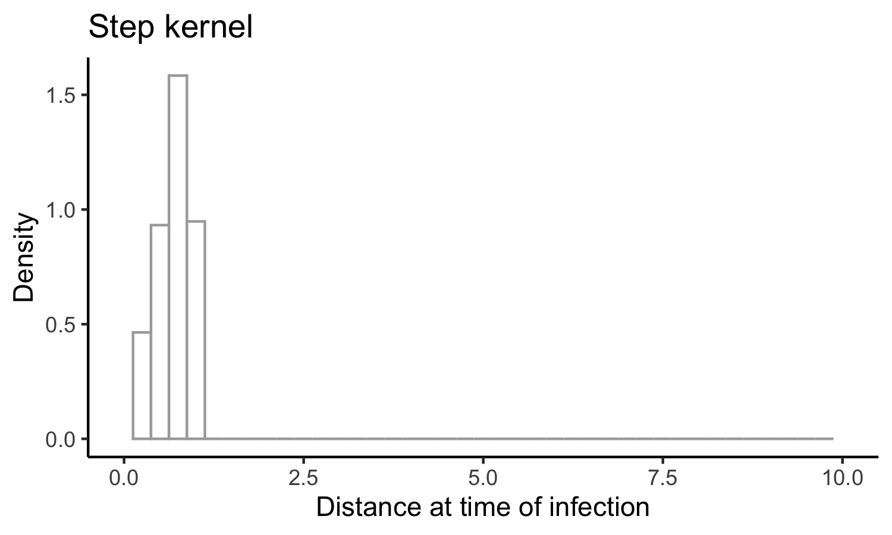

__Jump to__ 

- [18 July 2022](#18-July-2022)
- [2 Aug 2022](#2-Aug-2022)
- [26 Aug 2022](#26-Aug-2022)
- [9 Sep 2022](#9-Sep-2022)
- [13 Sep 2022](#13-Sep-2022)
- [14 Sep 2022](#14-Sep-2022)
- [10 Nov 2022](#10-Nov-2022)
- [1 Jan 2023](#1-Jan-2023)

# 18 July 2022 

The goal of this code is to __infer how the probability of transmission depends on the proximity and duration of contact.__ 

We're starting with a straightforward toy model that specifies the instantaneous hazard (force) of infection, $\lambda.$ This hazard can take a few forms: 

- A step function: 

$$ 
	\lambda(d) = \begin{cases}
	k & d \leq d^{\*} \\
	0 & d > d^{\*}
	\end{cases}
$$ 

<!-- $$
  \lambda(d) =  \begin{cases} 
  	k & d \leq d^* \\ 
  	0 & d > d^* 
  \end{cases} 
$$  -->

- A power-law decay with distance: 

$$ 
	\lambda(d) = \frac{k}{1 + d^\alpha}
$$ 

- An exponential decay with distance: 

$$ 
	\lambda(d) = k e^{-\phi d}
$$ 

The questions become: 

- Given some observations (locations over time, timing of infection), how precisely can we determine the kernel parameters ( $k$, $d^*$, $\alpha$, $\phi$)? 
- Under which circumstances can we distinguish between these models? 
- When does it matter to be able to distinguish between models? 
- What sorts of experiments do we need to run (sample size, frequency of observation, precision with which we need to know epidemiologic links) to measure the infection kernel with sufficient accuracy to inform interventions (_e.g.,_ isolation period, gathering size restrictions, general risk communication)? 

I'll begin with a simulation model with discrete events in continuous time. That is, I'll define rates for (a) movement and (b) infection and will update these states according to the Gillespie algorithm. Here's the algorithm: 

1. pick a movement distribution (normal with mean 0 and some standard deviation $\sigma$) 
2. pick a movement rate - a kinetic energy of the population. Call it $\mu$.
3. define the hazard of infection as a function with distance. We’ll use $\lambda = k e^{-\phi d}$, where we’ll need to specify *k* (the hazard of infection at proximity of 0) and φ (the exponential rate at which the infection hazard decays)
4. Start the simulation with just two agents moving around. Monitor when the uninfected one gets infected. 

Based on this information, can we determine the shape of the kernel? with what precision? And next, we can ask about uncertainty in both the locations and the time of infection. How does this affect our ability to do inference?

---

Let's start with some simple visualizations of the time to infection occuring, in branch `Explore`.

First, here's a histogram of the times when infections occur: 

Seems... reasonable. Now let's look at the distance between individuals when the infection occurs: 

Seems like this will be much more informative (for the step function, for example, we wouldn't see any infections occurring past $d^* $). 

# 2 Aug 2022

I've now implemented the power and step kernels. Let's have a look at what the time and distance of infection looks like for these, side-by-side with the exponential kernel: 

and the times of infection: 

Let's have a look at exactly what the kernels look like (how should we ensure comparability between them, somehow? something like a common area under the curve?): 

Given this, it makes sense why the power function would yield such shorter times-to-infection, since there's still substantial force of infection even at the longest distances. The exponential kernel looks a lot more like the step kernel. 

One option might be to come up with a general sigmoidal kernel that has an (optional) neck, something that accommodates power, exponential, and step-like forces of infection. Monotonically decreasing, with at most one change in concavity. That should specify a pretty general class of things. And then the question is: how do these kernels differ in the spread of infection? To what extent can we distinguish between them, and when does it matter to distinguish between them? 

What might such a kernel look like? 

Going back to the distance kernels from my thesis: recall that 

$$ e^{-x} = \lim_{n \rightarrow \infty} (1 + \frac{x}{n})^{-n}$$ 

and so 

$$ k e^{-\phi d} = \lim_{\alpha \rightarrow \infty} k \Bigl( 1 + \frac{\phi d}{\alpha}\Bigr)^{-\alpha} $$

that's more in line with the parameterization I'd proposed earlier. What about the step function? Any way to get this thing consistent with something logistic? Because for now the kernel we're working with is 

$$ \lambda(d)  = k \Bigl( 1 + \frac{\phi d}{\alpha}\Bigl)^{-\alpha} $$

which is a power function that approximates an exponential function with decay rate $\phi$ as $\alpha$ increases. 

Recall that the standard logistic function is 

$$ \frac{1}{1 + e^{-x}} $$ 

Alright - I've ended up with something like 

$$ \lambda(d) = \frac{k \Bigl[1 + (1 - \frac{\phi d^{\*} }{\alpha})^\alpha\Bigr]}{1 + \Bigl(1 + \frac{\phi (d - d^{\*} )}{\alpha}\Bigr)^\alpha} $$

That's almost it - it behaves like I want it to for large $\alpha$, but strangely for small parameter values (near 1). Getting somewhere though. 

# 26 Aug 2022 

I'm going to try to summarize my last meeting with Mark - we'd decided on drafting something of a grant proposal, and it was clear in my head then. It's not clear anymore. Going to try to make it clear again. 

--- 

His idea, I think, was that we have some kind of function we're interested in: like 

$$ \text{contagiousness} = f(\text{infectiousness}, \text{susceptibility}, \text{contact distance}, \text{contact duration}) $$ 

He was claiming that infectiousness and susceptibility are independent: 

$$ p_c = p_i p_s p_{cd} p_{ct} $$ 

and also that 

$$ \text{infection event} = f(\text{contagiousness},\text{contact frequency}) $$ 

where 

$$ p_e = p_c p_f $$ 

I'm not sure these are all the right terms, but that's what we're starting with. 

I think that my angle was that we could incorporate something like this into the renewal equation framework, and ask questions about inference. What set of probability functions are relevant here? Essentially, how can we build up an SIR-like model from a statistical-mechanic framework? 

And a key question: what is it that we're trying to describe with the equations? The probability of getting infected? The total number of infected people? Probably the latter - this is the closest analog to the Boltzman equations - but we'll probably want to aim for both. 

# 9 Sep 2022 

Thinking of things to put into a grant proposal: 

the infectiousness distribution (the thing you integrate to get R0) is a function of things both inherent to the virus and to behavior - critically, to the way people move and interact. How can we build this up from first principles? What data would we need to collect to specify this? What underlying mechanics are consistent with a given epidemiological model?

# 13 Sep 2022

I've gone back to Breda _et al._'s paper, ["On the formulation of epidemic models (an appraisal of Kermack and McKendrick)"](https://www.tandfonline.com/doi/full/10.1080/17513758.2012.716454) to get to grips with renewal equations. I think I've gotten the intuition and its link with the mathematics. I'm going to write it out here so I can refer back when I need to:

The idea behind the renewal equations is this: we begin with the most general transmission model, where 

$$ \dot{S} = -F(t) S(t)$$ 

where $F(t)$ is the force of infection at time $t$ and $S(t)$ is the proportion of susceptible individuals in the population. 

Furthermore, we can express $F(t)$ in terms of all of the infections that have come before time $t$: 

$$ F(t) = \int_0^\infty F(t-\tau) S(t-\tau) A(\tau) d\tau $$ 

The intuition here is that the force of infection $F$ at time $t$ is equal to the total incidence from all times prior to that point ( $F(t-\tau) S(t-\tau)$ ) multiplied by the infectiousness profile $A(\tau)$, indexed from the time of infection. 

Now: how does this relate to the standard SIR and SEIR models? Let's begin with the SIR model: 

$$ \frac{dS}{dt} = -\beta I S $$ 

$$ \frac{dI}{dt} = \beta I S - \alpha I $$ 

$$ \frac{dR}{dt} = \alpha I $$

Note that here the force of infection is 

$$ F(t) = \beta I(t) $$ 

What does that give us? Well, we can look at an expression for the prevalence of infectious individuals at time $t$, $I(t)$: 

$$ I(t) = \int_0^\infty F(t-\tau) S(t-\tau) P(I_\tau) d\tau $$ 

where $P(I_\tau)$ is the probability that a person is still in the infectious compartment at time $\tau$ after infection. For the SIR model, that probability is 

$$ P(I_\tau) = e^{-\alpha \tau} $$ 

That's because we're assuming a constant rate of leaving the compartment ( $\alpha$ ), and that yields an exponential distribution for the waiting times for leaving the compartment, and thus we have as the CDF of the relevant distribution 

$$ 1 - e^{-\alpha \tau} $$ 

which is the fraction of people who have left the compartment at time $\tau$. 1 - this is therefore the number of people remaining. What does this give us? 

$$ I(t) = \int_0^\infty F(t-\tau) S(t-\tau) e^{-\alpha \tau} d\tau $$ 

And we also know that 

$$ F(t) = \beta I(t) = \int_0^\infty F(t-\tau) S(t-\tau) \beta e^{-\alpha \tau} d\tau $$ 

and so 

$$ A(\tau) = \beta e^{-\alpha \tau} $$ 

which is what's reported by Breda and colleagues. 

---

Now, we can do the same thing for the SEIR model: 

$$ \frac{dS}{dt} = -\beta I S $$ 

$$ \frac{dE}{dt} = \beta I S - \gamma E $$

$$ \frac{dI}{dt} =  \gamma E - \alpha I $$ 

$$ \frac{dR}{dt} = \alpha I $$

The incidence is once again

$$ I(t) = \int_0^\infty F(t-\tau) S(t-\tau) P(I_\tau) d\tau $$ 

Here, the probability that a person is still in the $I$ compartment is more complex: it's the probability that they've already progressed past the $E$ compartment multiplied by the probability that they ahven't yet progressed to the $R$ compartment. 

The probability of progression from $E$ at time $\xi$ follows the density 

$$ \gamma e^{-\gamma \tau} $$ 

and of this fraction of people who have progressed at time $\xi$, the probability that they're still in $I$ is 

$$ e^{-\alpha(t-\xi)} $$

Putting this together, we get 

$$ P(I_\tau) = \int_{\xi=0}^{\tau} \gamma e^{-\gamma \tau} e^{-\alpha(\tau-\xi)} d\xi$$ 

here the integral is over all possible progression times $\xi$ from 0 to time $\tau$. 

This integral is straightforward to solve (pull out the $\tau$ terms, combine the exponentials, and you end up with the integral of a single exponential function); doing so gives us 

$$ P(I_\tau) = \frac{\gamma}{\gamma-\alpha} [e^{-\alpha \tau} - e^{-\gamma \tau}]$$

which we multiply by $\beta$ to get $A(\tau)$ as before. This again aligns with with Breda and colleagues found. 

---

So, I'm now happy that I have some intuition around how to translate from a set of ordinary differential equations to the renewal equation framework. The steps are: 

- Write the force of infection from the ODEs. 
- Write the integral equation giving the current prevalence as a function of past force of infection times past susceptibility times the probability of remaining infectious at time $\tau$. 
- Figure out what this probability of remaining in the $I$ compartment at time $\tau$ is; that's the bulk of what $A(\tau)$ will be. 
- Multiply by any remaining terms to get back to the force of infection. You should now have an expression for $A(\tau)$. 

I'm not exactly sure how to go in the other direction (Breda says that it's an iff, but I've only gone ODE $\rightarrow$ renewal equation). Still, this is a good place to start. 

---

The next thing is to figure out what underlying assumptions are baked into the $A(\tau)$. Clearly it's a little bit of infectiousness, a little bit of recovery, a little bit of natural history of infection, a little bit of contact rates, a little bit of distances. I want to build this up piece by piece. 

How can we build up an $A(\tau$) from a statistical mechanic standpoint? Let's start with the SIR: 

I think that the assumption here is that a person has constant infectiousness for their entire duration of infection, and that the duration of infection has a time that's distributed exponentially (that is, a constant rate of leaving the infectious compartment). 

The first step, I think, is to make sure that this re-captures the form of $A(\tau)$ that we expect. Then, we can ask: are there other underlying dynamics that would be conisistent with this? 

# 14 Sep 2022

I like the idea of simulating infections in a circle. I also think that one way to run these simulations and to get back something like $A(\tau)$ would be to just run the simulation in a population where just one person is infected, and stop the simulation after the person has recovered (or at some max time, if we let the person be infectious forever; but I can't imagine we'll be doing that). 

If we do that, then we should get a distribution for the number of infections and the times of those infections - which should give us $A(\tau)$ directly. 

It would be good to have this running so that we can have a simulation framework for testing whatever theory we come up with. Seems like this is what Casey did with the testing framework that she and Dan are working on. 

# 10 Nov 2022

Yikes. Don't look at that last date gap. 

After the last meeting with Mark, we agreed that it would be worth ironing out the statistical mechanic framework behind the SIR - at least enough to get a preliminary paper written, and maybe the start of a larger grant. 

To get there, I need to do some mathematical analysis, but I'd also like to run some simulations using different individual generation interval distributions that all sum to the same population-level generation interval distribution. I've made an early attempt at that in `threekernelsim.R`, but something isn't working right there. I'm going to take a step back and think about how to structure that code, and maybe take a second approach. 

So, the structure: 

I think there must be some way of simulating when the next event occurs... when rates are constant, the time of the next event is exponentially distributed with rate equal to the total rate of all events occuring. I guess rather than going stepwise like I originally had, we could integrate forward for all time(?) and ask how many events occur in some (long) time horizon, say until some tmax end of the epidemic. But then we still only step forward to the next event, which we have to find somehow. And i think once we do that, we start the whole process again; yes? I think that makes sense, since all of the events should be independent. 

We need some notation, so that we can attack this in a general sense. Let's say that $f_i(t)$ is the infectiousness distribution for person $i$. Then, $F_i(t) = \int_{0}^t f_i(u) du$ is the cumulative infectiousness between time 0 and time $t$. For most well-behaved $f$, we should be able to calculate $F$ explicitly, for any $t$. 

When we have, then the total infectiousness between time 0 and time $t$ should be 

$$ \sum_i F_i(t) $$ 

yes? 

This looks extremely useful re:simulation: https://pubs.acs.org/doi/10.1021/jp993732q

# 1 Jan 2023

Working on simulating infection dynamics with different individual-level infectiousness kernels. 

An individual infectiousness kernel (for person _i_) is, say, 

$$ \lambda_i(t)/N $$ 

where _N_ is the population size; we need this normalization so that when we integrate $\lambda_i(t)$ from t = 0 to infinity, we get the individual reproduction number, and yet when we propagate infections (integrating the product of this thing times the number of susceptibles), we get the proper thing. 

But we want this in a stochastic framework: how exactly do we link these infectiousness profiles with a stochastic infection rate? 

Think about the basic SIR: we have constant infectiousness, for an exponentially-dsitributed amount of time. For a person whose infectiousness lasts for the average amount of time, we should get a total area under the curve equal to the reproduction number. So, say that a person is infectious for five days on average, and the reproduction number is 2; then the infectiousness profile should be something like y=2/5 between 0 and 5, and 0 thereafter. The infectiousness profile is y=2/5 for everyone, for as long as they're infectious; it's just that the end of infectiousness is exponentially distributed. 

Then, what does this mean in a stochastic framework? Let's think from the perspective of a susceptible person: that person will become infected at time _t_ with probability $\frac{1}{N} (1 - e^{-2t/5})$

The probability of any single susceptible person being infected needs to be 2/N. Right? So maybe exponentiation isn't the right thing here: we just have the probability of infection being 

$$ \frac{1}{N} \frac{2t}{5}$$ 

$$ = \frac{1}{N} \int_t \lambda_i(u) du $$ 

I think, too, that $\lambda_i(t)$ should give the distribution of when the infections occur - and also, I think, this should mean that when we have multiple people infected, the timing will follow the distribution given by 

$$ \sum_i \lambda_i(t) $$ 

So the algorithm could look something like: 

- Shoot forward some time step $\Delta t$ and calculate the number of infections. This will be a Binomial distribution with probability $p = \frac{1}{N} \sum_i \int_t \lambda_i(u) du$. 
- If infections occurred, we need to draw their times. These times are distributed as $f(t) = \sum_i \lambda_i(t)$. 
- Take just the first infection. Update the system and start again from the time of that infection. 

The trick will be finding a way to do this quickly. 

Can we do all of these calculations in terms of the cumulative infectiousness profiles? 

$$ p = \frac{1}{N} \sum_i [\Lambda_i(t + \Delta t) - \Lambda_i(t)]$$ 

$$ F(t) = \int_{[0,t]} \sum_i \lambda_i(u) du$$ 

$$ F(t) = \sum_i \int_{[0,t]} \lambda_i(u) du$$ 

$$ F(t) = \sum_i \Lambda_i(t) $$ 

I think this is right... clearly F is unnormalized so far, but I don't think we care about that. Ideally we could use the inverse CDF method here... 
